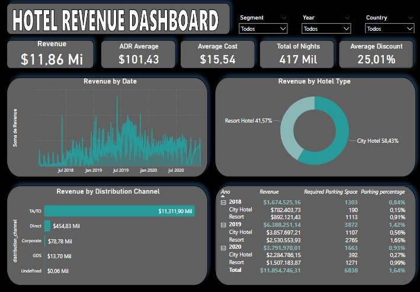
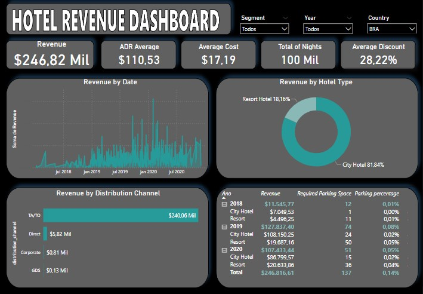

# Understanding the task and getting the data
**OBS: My Power BI version is in PT-BR. Pay attention to "." and "," separating numbers.**

Here we have 3 datasets of informations of a hotel, for the years of 2018, 2019 and 2020. Theses datasets are stored in 3 excel files. Our main goal is to analyze the revenue of the hotel for this triennium, and for that, we are going to use some concepts of SQL, Power Query and DAX to create a dashboard in Power BI.

First of all, we have to prepare our data to get started with the analysis. I'm using the MySQL database, so to import the data (in my case), we must save our excel files in csv format, but before that, we have to create our database and then connect to it, doing:

```sql
CREATE DATABASE PROJETO;
```
```sql
USE PROJETO;
```
Now that we have our database, we have to import the csv files that contain our data. Click the mouse's right buttom over your created database and then click on "Table Data Import Wizard". The table data import window will pop-up asking from which path you want to import your file and after you choose it, you will have another window asking if you want to create a new table or import your data to an existing table. The second option is used when you create your table previously, defining the the data type of each column, but for our case, we will create a new table (Repeat this process for the 3 tables).

With all the initial process done, we can finally do some work on the data. Since we 3 datasets, is a reasonable to create a new table contaning the information of all three of them. For that, we can do:
```sql
CREATE TABLE HOTELS AS
SELECT * FROM hotel_2018
UNION ALL
SELECT * FROM hotel_2019
UNION ALL
SELECT * FROM hotel_2020;
```
# Doing some work!
Now that we have an unified dataset, we can ask for some measures to investigate our data. When you are working with data from some company, a crucial measure to have is the revenue since every manager or owner want to know how much money the company is making. Some datasets already bring this information as a column, but for our case, we got to create it. So, looking at the dataset, our revenue is going to be the result of the sum of the total stays in week nights and the total stays in weekend nights, multiplied by the adr (average daily rate). We can query that by doing:
```sql
SELECT 
arrival_date_year as Arrival_Year,
hotel,
ROUND(SUM((stays_in_week_nights + stays_in_weekend_nights)*adr),2) AS Revenue
FROM HOTELS
GROUP BY arrival_date_year, hotel;
```
| Arrival_Year   | hotel        | Revenue    |
|----------------|--------------|------------|
| 2018           | City Hotel   | 3,291,100.55 |
| 2018           | Resort Hotel | 3,526,408.51 |
| 2019           | City Hotel   | 1,4096,598 |
| 2019           | Resort Hotel | 9,268,324 |
| 2020           | City Hotel   | 9,328,218 |
| 2020           | Resort Hotel | 6,219,692 |

From this simple table we can draw some important informations. In 2018, most of the revenue came from Resort Hotels, around 3.1 million dollars. However, in 2019 and 2020, City Hotels were more profitables. We can also take a look at the mean of revenue per stay in each year, by doing:
``` sql
SELECT h1.arrival_date_year as Year, 
ROUND((SUM((h1.stays_in_week_nights + h1.stays_in_weekend_nights)*h1.adr))/COUNT(*),2) AS Average_Revenue
FROM hotel_2018 h1;
```
``` sql
SELECT h2.arrival_date_year as Year, 
ROUND((SUM((h2.stays_in_week_nights + h1.stays_in_weekend_nights)*h2.adr))/COUNT(*),2) AS Average_Revenue
FROM hotel_2019 h2;
```
``` sql
SELECT h3.arrival_date_year as Year, 
ROUND((SUM((h3.stays_in_week_nights + h1.stays_in_weekend_nights)*h3.adr))/COUNT(*),2) AS Average_Revenue
FROM hotel_2020 h3;
```
| Stay_year         | Average_Revenue | 
|-------------------|--------------|
| 2018              | 310.00   | 
| 2019              | 341.24   |
| 2020              | 443.93   |

Those are interesting results, since although 2019 was the year with the highest number of accomodations, 2020 was the most profitable when considering the relation revenue per stays.

There two other tables of interest to work with (import them to your SQL database), one of them brings informations about the discount earned by market segment, and the other one, informations of meal prices. We can look and join these information to our main table, querying the following code:
``` sql
SELECT * FROM market_segment;
SELECT * FROM meal_cost;
```
``` sql
SELECT * FROM HOTELS
LEFT JOIN market_segment
ON HOTELS.market_segment = market_segment.market_segment
LEFT JOIN meal_cost
ON HOTELS.meal  = meal_cost.meal;
```
So now that we have done some ETL, let's bring our data to Power BI to build our dashboard. If you know how to work with Power BI, you can build your report in any way you want. Let's take a look at mine:

<p align="center">
  
</p>

From the that, we can draw some key and clear informations such as:
* The total revenue of the triennium was equal to 11,86 million dollars;
* The hotel had an average daily rate mean equal around 101,43 dollars;
* The Average discount applied was around 25%.

In terms of hotel type, it's clear that city hotels are the most wanted, however the percent difference is not so big (16.96%) when comparing to resort hotels. This indicates that the company's investiment is bringing profit on two fronts, in a well-distributed way.

Distribution channels are examples of segmentation that can be done to investigate the costumers of your business. For our case, we have TA/TO as the real dominant distribution channel, having about 11.3 of 11.86 million dollars coming from it. It is really somenthing to look at, perharps a few marketing/admistrative actions could be taken to try to bring in more money from the other distribution channels.

By looking at the curve chart, it's clear that this hotel had its peak in 2019 and had a revenue drop in the next year. Why was that? Had the Covid-19 pandemic  something to do with it? Probably. What about the revenue by countries? You can check that information selecting your country of interest. For example, let's check it for Brazil:

<p align="center">
  
</p>

The country information can be very useful, guiding the stakeholders to considering an investment on marketing and deals, targeting people from those countries that produce fewer costumers.

Since I am not able to create a account to share the dashboard online, due to a cellphone code problem for Brazil, it is available in my Github repository.
